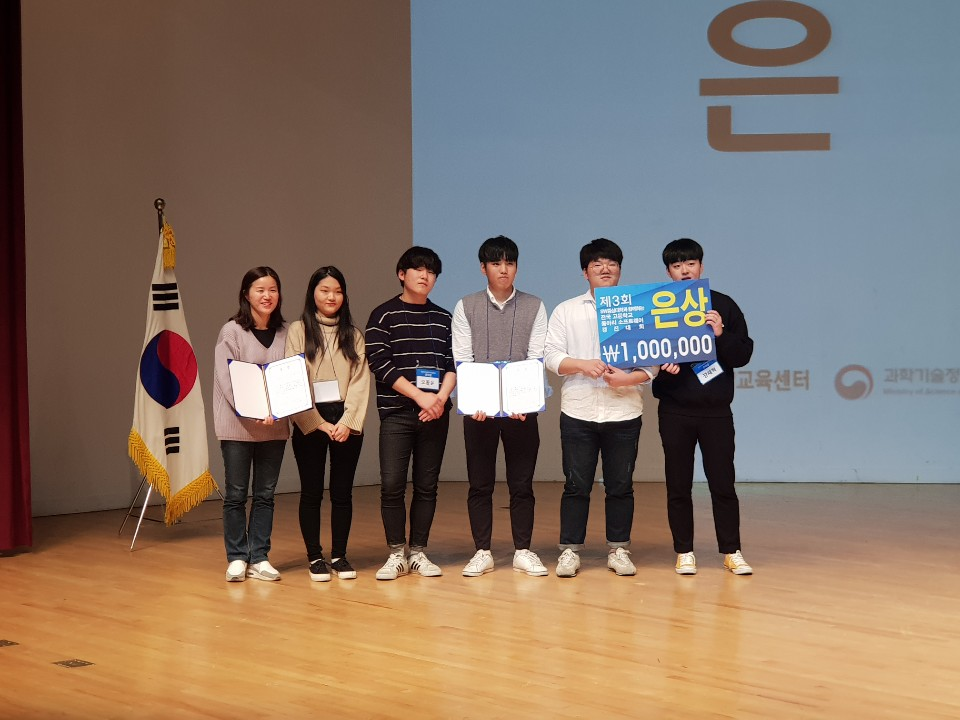

<div align="center">

# block-vote-service
제 3회 전국 동아리 SW 경진대회 `블록체인을 활용한 전자투표 서비스` 프로젝트 저장소입니다.


# 수상!
근자감 팀 `은상` 수상! 수고하셨습니다.



</div>

# 팀 정보
- 팀명: `근자감`
- 김지호
- 이근혁
- 장재혁
- 오동윤
- 박하은

# 개발환경
- `Python 3.6.5`
- `MySQL 8.0.12.0`

# 프로젝트 디렉토리 구조
- 아래 정보는 본 디렉토리 구조 트리입니다.
```bash
|
+-- /doc
|    # 산출물 저장 폴더
|
+-- /src
|    +-- /app
|    |    # 실제 개발 코드 디렉토리
|    +-- /test
|         # 라이브러리 임시 코드 / 테스트 코드 디렉토리
|
+-- READMD.md # 프로젝트 정보 문서
``` 

# 정보
`Copyright (c) 2018 GMMAHS Community`